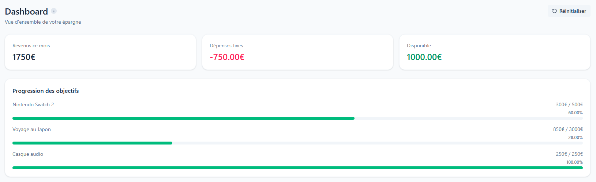
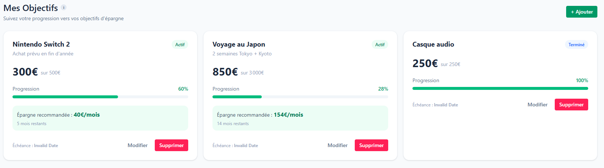
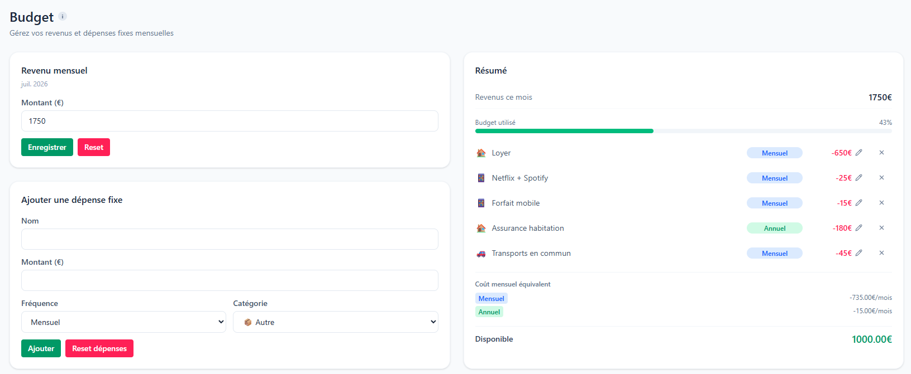
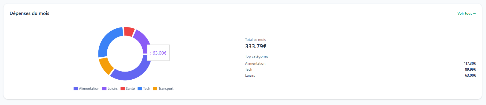

# BudgetFlow

Application de gestion budgétaire personnelle : planifiez vos revenus et dépenses fixes, suivez vos dépenses réelles au quotidien, et pilotez vos objectifs d'épargne.

Conçue en **local-first** — vos données restent dans votre navigateur, sans compte requis et sans serveur.


🔗 **[Voir la démo en ligne →](https://showmybudget.vercel.app/)**



<p align="center"><em>Dashboard — revenus, dépenses fixes, reste disponible et progression des objectifs</em></p>

---

## Fonctionnalités

### 📊 Dashboard
Vue d'ensemble de la situation financière : revenus du mois, total des dépenses fixes, reste disponible, progression globale de l'épargne, top catégories de dépenses du mois et graphique d'épargne par objectif.

### 🎯 Objectifs
Objectifs d'épargne avec montant cible, échéance optionnelle et statut (`actif` / `en pause` / `terminé`). L'application calcule la progression, le nombre de mois restants avant l'échéance et la **contribution mensuelle suggérée** pour tenir le délai. Le statut `terminé` est dérivé de l'épargne atteinte, pas saisi à la main.



### 💰 Budget
Saisie du revenu mensuel (par mois, format `YYYY-MM`) et des dépenses fixes récurrentes. Chaque dépense a une fréquence — `quotidienne`, `hebdomadaire`, `mensuelle`, `trimestrielle`, `semestrielle`, `annuelle` — **normalisée en équivalent mensuel** pour que le budget reste comparable d'un mois à l'autre. Vue prévisionnelle sur 12 mois.

Le bloc « Coût mensuel équivalent » montre cette normalisation à l'œuvre : une assurance annuelle de 180 € est comptée comme 15 €/mois, et non ignorée onze mois sur douze.



### 🧾 Dépenses
Journal des dépenses réelles du quotidien, avec catégorie, tag (`fixe` / `variable` / `ponctuelle`) et date. Filtrage par mois, catégorie et tag, total du mois, et graphique de répartition par catégorie. Tri par date décroissante.



### ⚙️ Paramètres
- **Export JSON** — sauvegarde complète des données
- **Import JSON** — restauration, avec validation du fichier et rejet des sauvegardes invalides
- **Données de démonstration** — remplit l'app avec un jeu de données réaliste
- **Réinitialisation** — remise à zéro, avec confirmation

L'interface est entièrement responsive : sidebar sur desktop, barre d'onglets en bas de l'écran sur mobile.

---

## Stack technique

| Couche | Choix |
|---|---|
| Framework | React 19 + TypeScript |
| Build | Vite 8 |
| Styling | Tailwind CSS 4 |
| Routing | react-router-dom 7 |
| Graphiques | Recharts 3 |
| Icônes | lucide-react |
| State | Context API + `useReducer` |
| Persistance | `localStorage` (+ export/import JSON) |
| Cloud (optionnel) | Supabase — Auth + PostgreSQL + RLS |

---

## Démarrage

```bash
git clone https://github.com/VicdSpt/BudgetFlow.git
cd BudgetFlow
npm install
npm run dev
```

L'application démarre sur `http://localhost:5173` et fonctionne immédiatement — aucune configuration, aucune variable d'environnement, aucun backend.

### Scripts

| Commande | Rôle |
|---|---|
| `npm run dev` | Serveur de développement (HMR) |
| `npm run build` | Typecheck (`tsc -b`) puis build de production |
| `npm run preview` | Sert le build de production en local |
| `npm run lint` | ESLint |

---

## Architecture

```
src/
  features/              une feature = composants + hooks + types + utils
    goals/
    budget/
    transactions/
    dashboard/           lit uniquement le context global, pas d'état propre
  context/
    AppContext.tsx       type + createContext + useAppContext()
    AppReducer.ts        fonction pure (state, action) => state
    AppProvider.tsx      useReducer, persistance, hydratation
    AuthContext.tsx      \  couche compte cloud, optionnelle
    AuthProvider.tsx     /
  components/ui/         Button, Input, Modal, ProgressBar, ConfirmDialog…
  pages/                 une page par route
  lib/                   client Supabase, mappers, sync, fetch
  utils/                 dateUtils, demoData
  router/
```

**Flux de données**

```
Interaction utilisateur
  → le composant dispatch une action
    → AppReducer calcule le nouveau state
      → AppProvider persiste (localStorage, ou Supabase si connecté)
        → les composants re-render via le context
```

Deux règles structurantes : le context global est le **seul** point de partage entre features, et aucune logique métier ne vit dans un composant — tout passe par un hook ou un util.

---

## Décisions techniques

Quelques choix non triviaux, et leur raison :

**Reducer pur.** La génération des `id` et des `createdAt` a été sortie du reducer vers les hooks. Un reducer qui appelle `crypto.randomUUID()` ou `new Date()` n'est pas déterministe, donc pas testable — et il empêche de réutiliser le payload pour l'écriture distante.

**Local-first avec cloud optionnel.** La synchronisation Supabase est présente dans le code mais activée par un unique flag dérivé des variables d'environnement (`isSupabaseConfigured`). Sans clés configurées, l'app est 100 % locale et **n'affiche aucune trace** de la fonctionnalité compte — plutôt qu'un bouton menant à une erreur réseau. C'est de la dégradation gracieuse : la fonctionnalité est absente, pas cassée.

**UI optimiste.** En mode connecté, le `dispatch` exposé par le context applique la mutation locale immédiatement puis reflète l'écriture vers Supabase en arrière-plan. L'interface ne reste jamais en attente du réseau.

**Isolation par utilisateur au niveau base.** Les 4 tables utilisent le Row Level Security de PostgreSQL (`auth.uid() = user_id`). Le filtrage n'est pas fait côté client — un `select *` ne peut structurellement pas retourner les lignes d'un autre compte.

**Mapping explicite camelCase ↔ snake_case.** Le domaine TypeScript reste idiomatique (`targetSavings`), le schéma SQL aussi (`target_savings`), avec des fonctions de conversion dédiées à la frontière. Pas de conversion automatique magique.

**Dates en heure locale.** Le mois courant et la date du jour sont calculés via un util partagé plutôt qu'avec `toISOString()`, qui convertit en UTC — source d'un décalage d'un jour (voire d'un mois) selon le fuseau et l'heure de la journée.

**Fréquences normalisées.** Une dépense annuelle n'est pas ignorée les 11 autres mois : `expenseForMonth` la convertit en équivalent mensuel pour garder un budget cohérent.

---

## Persistance des données

En mode local, les données sont stockées dans le `localStorage` du navigateur sous trois clés (`budgetflow_goals`, `budgetflow_budget`, `budgetflow_transactions`). Elles survivent à la fermeture du navigateur et au redémarrage de la machine.

À savoir :
- Le stockage est **cloisonné par origine** — `localhost:5173` et l'URL de production sont deux jeux de données distincts, tout comme deux navigateurs différents
- Vider les données de navigation efface tout
- Ce n'est pas une sauvegarde : un seul appareil, aucune copie

D'où l'export JSON dans les Paramètres, qui est le vrai filet de sécurité.

---

## Mode compte cloud (optionnel)

Pour activer la synchronisation multi-appareils :

1. Créer un projet sur [supabase.com](https://supabase.com)
2. SQL Editor → exécuter [`supabase/schema.sql`](supabase/schema.sql) (tables + policies RLS)
3. Settings → API → récupérer l'URL du projet et la clé `anon public`
4. Créer un fichier `.env.local` à la racine :

```
VITE_SUPABASE_URL=https://xxxx.supabase.co
VITE_SUPABASE_ANON_KEY=eyJ...
```

5. Redémarrer le serveur de dev

L'écran de connexion et le bloc compte apparaissent alors dans la navigation. À la première connexion, si le compte est vide et que l'appareil contient des données locales, l'app propose de les migrer.

> Les variables sont injectées **au build**. En déploiement, les ajouter aux variables d'environnement de la plateforme ne suffit pas — il faut redéployer.

---

## Roadmap

- [ ] Tests unitaires (reducer, utils de calcul) avec Vitest
- [ ] Code-splitting par route pour réduire le bundle
- [ ] Notifications d'erreur en UI plutôt qu'en console

---

## Licence

Projet personnel à but pédagogique et démonstratif.
